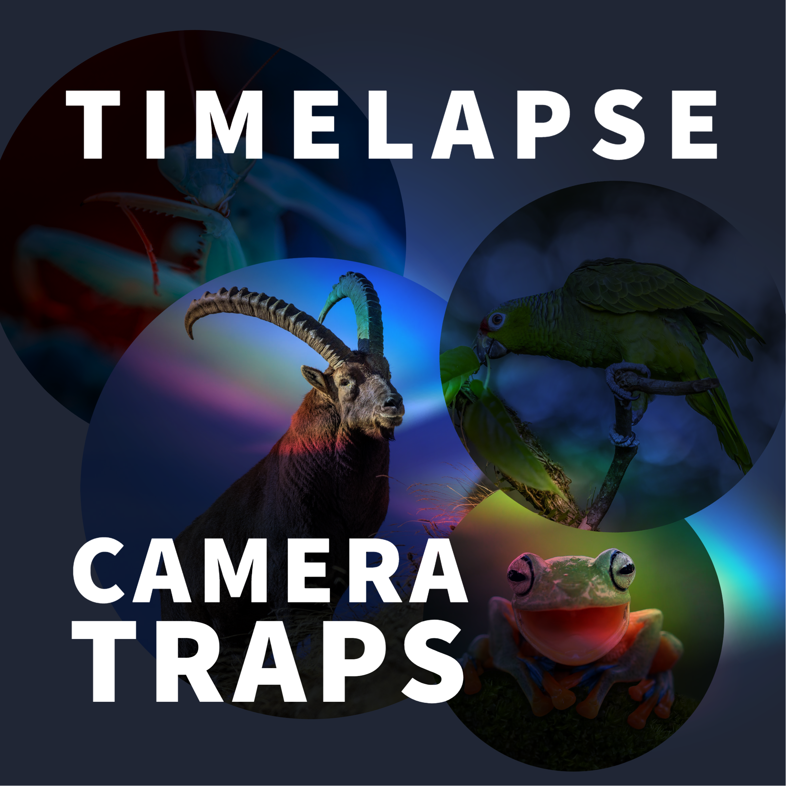

# Camera-Traps-and-Saul-Greenbergs-Timelapse
Saul Greenberg‘s Timelapse software annotates photos (.jpg) and videos (.avi, .mp4, or .asf) and the following [Camera Traps and Timelapse](FADAIR2022_CameraTraps_Timelapse.pdf) guide demonstrates an annotation workflow that can be used with Timelapse for camera trap projects. 

## Acknowledgements
I would like to thank Naomi Matthews and Stuart Nixon for their expertise and guidance. 

## References

- Greenberg S. (2022). Timelapse Database Guide. Retrieved from: https://saul.cpsc.ucalgary.ca/timelapse/pmwiki.php?n=Main.UserGuide
- Greenberg S. (2022). Timelapse Image Recognition Guide. Retrieved from: https://saul.cpsc.ucalgary.ca/timelapse/pmwiki.php?n=Main.UserGuide
- Greenberg S. (2022). Timelapse Quick Start Guide. Retrieved from: https://saul.cpsc.ucalgary.ca/timelapse/pmwiki.php?n=Main.UserGuide
- Greenberg S. (2022). Timelapse Reference Guide. Retrieved from: https://saul.cpsc.ucalgary.ca/timelapse/pmwiki.php?n=Main.UserGuide
- Greenberg S. (2022). Timelapse Template Guide. Retrieved from: https://saul.cpsc.ucalgary.ca/timelapse/pmwiki.php?n=Main.UserGuide
